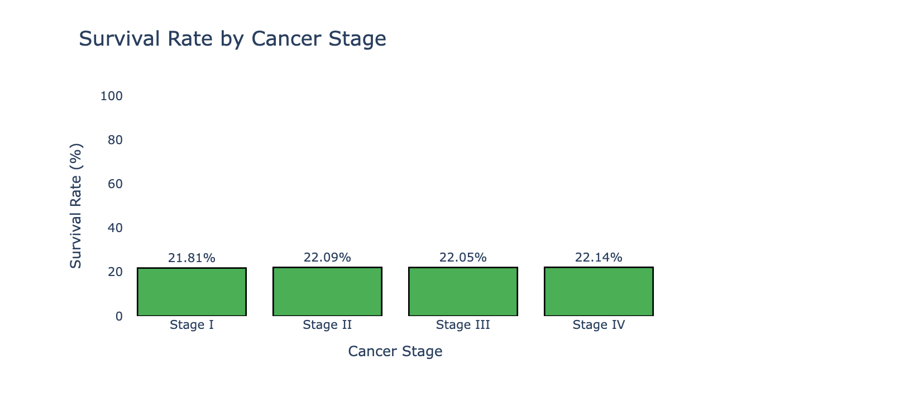
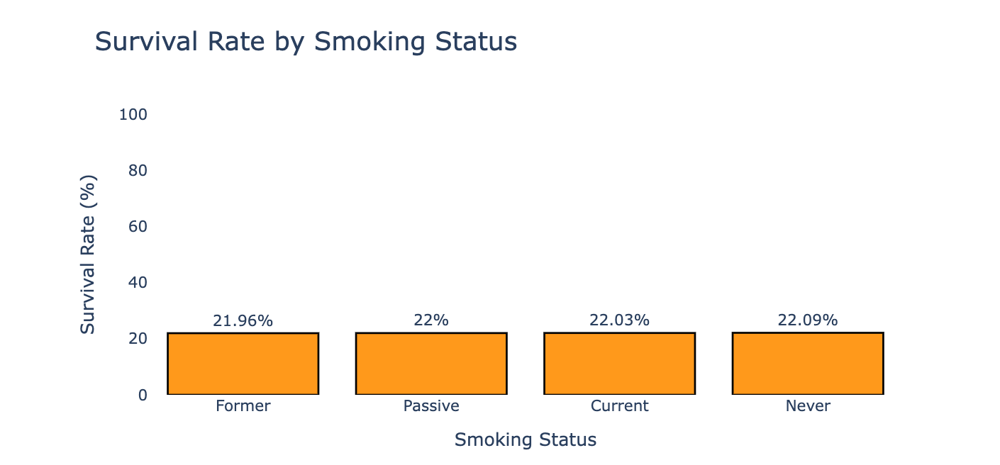

# Lung Cancer Survival Analysis – Lessons from Synthetic Data

**Dataset:** [Lung Cancer Survival (Kaggle)](https://lnkd.in/gjy5EveE)  
**Notebook on Kaggle:** [View here](https://lnkd.in/gjy5EveE)  
**YouTube Video (Norwegian):** [Watch here](https://lnkd.in/dXfyjNVM)

---

## 📌 Goal
To explore how cancer stage, smoking, and comorbidities affect survival outcomes in lung cancer patients.  

---

## 📊 Key Findings
- **Stage I vs Stage IV:** Almost identical survival rates.  
- **Smokers vs Non-smokers:** No clear difference in survival.  
- **Comorbidities:** Appeared irrelevant.  

---

## ⚠️ Critical Lesson
After hours of analysis, I discovered the dataset was **synthetic** and created for educational purposes.  
This explained the unrealistic results.  

**Takeaway:** Always investigate dataset origin and context before deep analysis.  

---

## 🔧 Tools
- Python (Pandas, Matplotlib, Seaborn)  
- Jupyter Notebook  

---

## 🖼️ Visuals

### Survival by Cancer Stage
  

---

### Survival by Smoking Status
  

